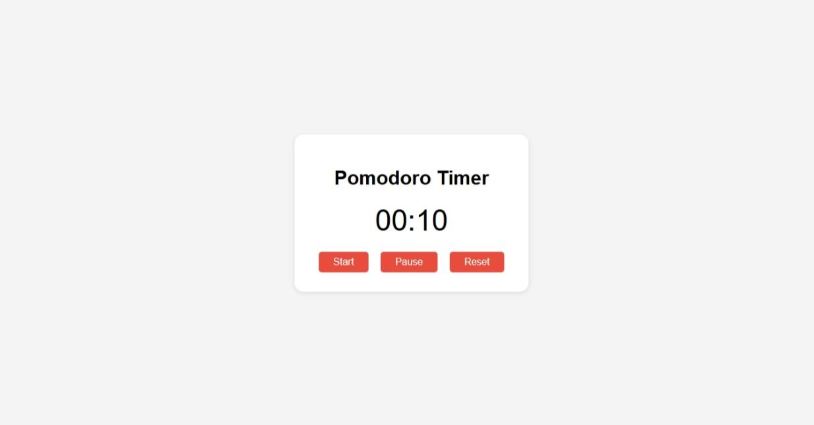
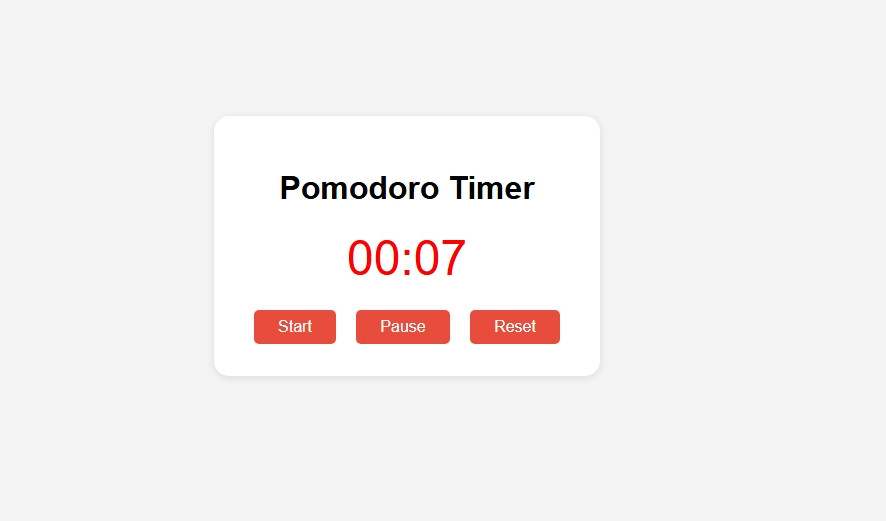
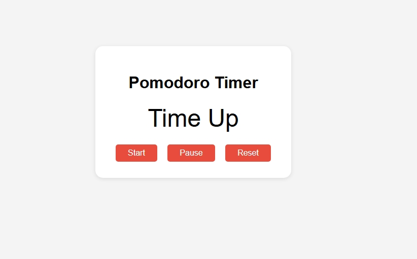

# Pomodoro-Timer
## Pomodoro Timer

A simple, customizable Pomodoro Timer web app built with HTML, CSS, and JavaScript. This project helps you manage your work and break intervals using the Pomodoro Technique to boost productivity and maintain focus.

---

## Features

- **Customizable Timer:** Easily set your desired work and break durations.
- **Start, Pause, and Reset:** Full control over your timer sessions.
- **Visual Alerts:**
  - Timer turns **red** when 5 seconds or less remain.
  - Timer **blinks** when 3 seconds or less remain.
- **Session End Display:** Shows "Time up" when the timer reaches zero.
- **Responsive Design:** Works on desktops and mobile devices.

---

## Technologies Used

- **HTML:** Page structure and layout.
- **CSS:** Styling, color changes, and blinking animation.
- **JavaScript:** Timer logic, interactivity, and UI updates.

---

## Images/ScreenShots <i class="fa-solid fa-images"></i>
Start Stage Image.
 

When press a pause button. 
 

Time Up. 

